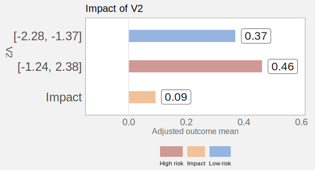
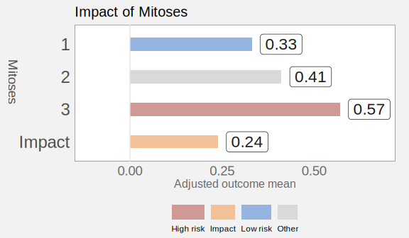

<!-- README.md is generated from readme.Rmd. Please edit that file -->

# varimpact - variable importance through causal inference

[](https://github.com/ck37/varimpact/actions/workflows/check-standard.yaml)
[](https://codecov.io/gh/ck37/varimpact)

## Summary

varimpact uses causal inference statistics to generate variable
importance estimates for a given dataset and outcome. It answers the
question: which of my Xs are most related to my Y? Each variable’s
influence on the outcome is estimated semiparametrically, without
assuming a linear relationship or other functional form, and the
covariate list is ranked by order of importance. This can be used for
exploratory data analysis, for dimensionality reduction, for
experimental design (e.g. to determine blocking and re-randomization),
to reduce variance in an estimation procedure, etc. See Hubbard,
Kennedy, & van der Laan (2018) for more details, or Hubbard & van der
Laan (2016) for an earlier description.

## Details

Each covariate is analyzed using targeted minimum loss-based estimation
([TMLE](https://CRAN.R-project.org/package=tmle)) as though it were a
treatment, with all other variables serving as adjustment variables via
[SuperLearner](https://github.com/ecpolley/SuperLearner). Then the
statistical significance of the estimated treatment effect for each
covariate determines the variable importance ranking. This formulation
allows the asymptotics of TMLE to provide valid standard errors and
p-values, unlike other variable importance algorithms.

The results provide raw p-values as well as p-values adjusted for false
discovery rate using the Benjamini-Hochberg (1995) procedure. Adjustment
variables are automatically clustered hierarchically using HOPACH (van
der Laan & Pollard 2003) in order to reduce dimensionality. The package
supports multi-core and multi-node parallelization, which are detected
and used automatically when a parallel backend is registered. Missing
values are automatically imputed using K-nearest neighbors (Troyanskaya
et al. 2001, Jerez et al. 2010) and missingness indicator variables are
incorporated into the analysis.

varimpact is under active development so please submit any bug reports
or feature requests to the [issue
queue](https://github.com/ck37/varimpact/issues), or email Alan and/or
Chris directly.

## Installation

### GitHub

``` r
# Install remotes if necessary:
# install.packages("remotes")
remotes::install_github("ck37/varimpact")
```

### CRAN

varimpact is not on CRAN yet; install from GitHub as above.

## Examples

### Example: basic functionality

``` r
library(varimpact)

####################################
# Create test dataset.
set.seed(1, "L'Ecuyer-CMRG")
N <- 200
num_normal <- 4
X <- as.data.frame(matrix(rnorm(N * num_normal), N, num_normal))
Y <- rbinom(N, 1, plogis(.2*X[, 1] + .1*X[, 2] - .2*X[, 3] + .1*X[, 3]*X[, 4] - .2*abs(X[, 4])))
# Add some missing data to X so we can test imputation.
for (i in 1:10) X[sample(nrow(X), 1), sample(ncol(X), 1)] <- NA

####################################
# Basic example
vim <- varimpact(Y = Y, data = X)
#> Finished pre-processing variables.
#> 
#> Processing results:
#> - Factor variables: 0 
#> - Numeric variables: 4 
#> 
#> No factor variables - skip VIM estimation.
#> 
#> Estimating variable importance for 4 numerics.

# Review consistent and significant results.
vim
#> No significant and consistent results.
#> All results:
#>       Type   Estimate             CI95   P-value Adj. p-value  Est. RR
#> V1 Ordered 0.14594569 (-0.139 - 0.431) 0.1576403    0.3173261 1.485982
#> V2 Ordered 0.09282500 (-0.162 - 0.348) 0.2378623    0.3173261 1.254249
#> V3 Ordered 0.08669212 (-0.152 - 0.325) 0.2379946    0.3173261 1.197426
#> V4 Ordered 0.04143251 (-0.246 - 0.329) 0.3886701    0.3886701 1.092521
#>           CI95 RR P-value RR Adj. p-value RR Consistent
#> V1  (0.58 - 3.81)  0.2045956       0.3509072       TRUE
#> V2 (0.622 - 2.53)  0.2225937       0.3509072       TRUE
#> V3  (0.754 - 1.9)  0.2631804       0.3509072       TRUE
#> V4 (0.606 - 1.97)  0.3843299       0.3843299       TRUE

# Look at all results.
vim$results_all
#>       Type   Estimate             CI95   P-value Adj. p-value  Est. RR
#> V1 Ordered 0.14594569 (-0.139 - 0.431) 0.1576403    0.3173261 1.485982
#> V2 Ordered 0.09282500 (-0.162 - 0.348) 0.2378623    0.3173261 1.254249
#> V3 Ordered 0.08669212 (-0.152 - 0.325) 0.2379946    0.3173261 1.197426
#> V4 Ordered 0.04143251 (-0.246 - 0.329) 0.3886701    0.3886701 1.092521
#>           CI95 RR P-value RR Adj. p-value RR Consistent
#> V1  (0.58 - 3.81)  0.2045956       0.3509072       TRUE
#> V2 (0.622 - 2.53)  0.2225937       0.3509072       TRUE
#> V3  (0.754 - 1.9)  0.2631804       0.3509072       TRUE
#> V4 (0.606 - 1.97)  0.3843299       0.3843299       TRUE

# Plot the V2 impact.
plot_var("V2", vim)
```



``` r

# Generate latex tables with results.
exportLatex(vim)
#> NULL

# Clean up LaTeX files
cleanup_latex_files()
```

### Example: customize outcome and propensity score estimation

``` r
Q_lib = c("SL.mean", "SL.glmnet", "SL.ranger", "SL.rpartPrune")
g_lib = c("SL.mean", "SL.glmnet")
set.seed(1, "L'Ecuyer-CMRG")
(vim = varimpact(Y = Y, data = X, Q.library = Q_lib, g.library = g_lib))
#> Finished pre-processing variables.
#> 
#> Processing results:
#> - Factor variables: 0 
#> - Numeric variables: 4 
#> 
#> No factor variables - skip VIM estimation.
#> 
#> Estimating variable importance for 4 numerics.
#> No significant and consistent results.
#> All results:
#>       Type   Estimate             CI95   P-value Adj. p-value  Est. RR
#> V1 Ordered 0.11972453   (-0.11 - 0.35) 0.1536753    0.3199279 1.343059
#> V3 Ordered 0.11121909 (-0.122 - 0.344) 0.1747763    0.3199279 1.253538
#> V2 Ordered 0.09154387 (-0.162 - 0.346) 0.2399459    0.3199279 1.248120
#> V4 Ordered 0.03595027 (-0.252 - 0.324) 0.4033505    0.4033505 1.080330
#>           CI95 RR P-value RR Adj. p-value RR Consistent
#> V1 (0.706 - 2.55)  0.1548062       0.3519554       TRUE
#> V3 (0.811 - 1.94)  0.1841387       0.3519554       TRUE
#> V2 (0.627 - 2.48)  0.2639666       0.3519554       TRUE
#> V4 (0.597 - 1.95)  0.3992209       0.3992209       TRUE
```

### Example: parallel via multicore

``` r
library(future)
plan("multisession")
vim = varimpact(Y = Y, data = X)
#> Finished pre-processing variables.
#> 
#> Processing results:
#> - Factor variables: 0 
#> - Numeric variables: 4 
#> 
#> No factor variables - skip VIM estimation.
#> 
#> Estimating variable importance for 4 numerics.
```

### Example: mlbench breast cancer

``` r
data(BreastCancer, package = "mlbench")
data = BreastCancer

# Create a numeric outcome variable.
data$Y = as.integer(data$Class == "malignant")

# Use multicore parallelization to speed up processing.
plan("multisession")
(vim = varimpact(Y = data$Y, data = subset(data, select = -c(Y, Class, Id))))
#> Finished pre-processing variables.
#> 
#> Processing results:
#> - Factor variables: 9 
#> - Numeric variables: 0 
#> 
#> Estimating variable importance for 9 factors.
#> Significant and consistent results:
#>                Type  Estimate            CI95      P-value Adj. p-value
#> Bare.nuclei  Factor 0.5018849 (0.367 - 0.637) 1.602052e-13 1.441847e-12
#> Cell.size    Factor 0.5745486 (0.402 - 0.747) 3.381506e-11 1.521678e-10
#> Mitoses      Factor 0.2392427 (0.161 - 0.317) 1.011109e-09 2.274996e-09
#> Cl.thickness Factor 0.3805930 (0.251 - 0.511) 4.677600e-09 8.419679e-09
#>               Est. RR       CI95 RR   P-value RR Adj. p-value RR
#> Bare.nuclei  2.968525 (1.77 - 4.97) 3.356870e-12    3.021183e-11
#> Cell.size         Inf     (NA - NA) 6.480864e-10    2.916389e-09
#> Mitoses      1.720553 (1.47 - 2.01) 2.708806e-05    6.094813e-05
#> Cl.thickness 3.194347  (2.2 - 4.65) 6.051102e-05    1.089198e-04
plot_var("Mitoses", vim)
```



## Authors

Alan E. Hubbard and Chris J. Kennedy, University of California, Berkeley

## References

Benjamini, Y., & Hochberg, Y. (1995). Controlling the false discovery
rate: a practical and powerful approach to multiple testing. Journal of
the royal statistical society. Series B (Methodological), 289-300.

Gruber, S., & van der Laan, M. J. (2012). tmle: An R Package for
Targeted Maximum Likelihood Estimation. Journal of Statistical Software,
51(i13).

Hubbard, A. E., Kennedy, C. J., van der Laan, M. J. (2018).
Data-adaptive target parameters. In M. van der Laan & S. Rose (2018)
Targeted Learning in Data Science. Springer.

Hubbard, A. E., Kherad-Pajouh, S., & van der Laan, M. J. (2016).
Statistical Inference for Data Adaptive Target Parameters. The
international journal of biostatistics, 12(1), 3-19.

Hubbard, A., Munoz, I. D., Decker, A., Holcomb, J. B., Schreiber, M. A.,
Bulger, E. M., … & Rahbar, M. H. (2013). Time-Dependent Prediction and
Evaluation of Variable Importance Using SuperLearning in High
Dimensional Clinical Data. The journal of trauma and acute care surgery,
75(1 0 1), S53.

Hubbard, A. E., & van der Laan, M. J. (2016). Mining with inference:
data-adaptive target parameters (pp. 439-452). In P. Bühlmann et
al. (Ed.), Handbook of Big Data. CRC Press, Taylor & Francis Group, LLC:
Boca Raton, FL.

Jerez, J. M., Molina, I., García-Laencina, P. J., Alba, E., Ribelles,
N., Martín, M., & Franco, L. (2010). Missing data imputation using
statistical and machine learning methods in a real breast cancer
problem. Artificial intelligence in medicine, 50(2), 105-115.

Rozenholc, Y., Mildenberger, T., & Gather, U. (2010). Combining regular
and irregular histograms by penalized likelihood. Computational
Statistics & Data Analysis, 54(12), 3313-3323.

Troyanskaya, O., Cantor, M., Sherlock, G., Brown, P., Hastie, T.,
Tibshirani, R., Botstein, D., & Altman, R. B. (2001). Missing value
estimation methods for DNA microarrays. Bioinformatics, 17(6), 520-525.

van der Laan, M. J. (2006). Statistical inference for variable
importance. The International Journal of Biostatistics, 2(1).

van der Laan, M. J., & Pollard, K. S. (2003). A new algorithm for hybrid
hierarchical clustering with visualization and the bootstrap. Journal of
Statistical Planning and Inference, 117(2), 275-303.

van der Laan, M. J., Polley, E. C., & Hubbard, A. E. (2007). Super
learner. Statistical applications in genetics and molecular biology,
6(1).

van der Laan, M. J., & Rose, S. (2011). Targeted learning: causal
inference for observational and experimental data. Springer Science &
Business Media.
