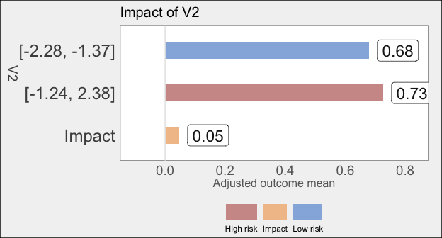

<!-- README.md is generated from README.Rmd. Please edit that file -->

# varimpact - variable importance through causal inference

[](https://travis-ci.org/ck37/varimpact)
[](https://ci.appveyor.com/project/ck37/varimpact)
[](https://codecov.io/gh/ck37/varimpact)

## Summary

varimpact uses causal inference statistics to generate variable
importance estimates for a given dataset and outcome. It answers the
question: which of my Xs are most related to my Y? Each variable’s
influence on the outcome is estimated semiparametrically, without
assuming a linear relationship or other functional form, and the
covariate list is ranked by order of importance. This can be used for
exploratory data analysis, for dimensionality reduction, for
experimental design (e.g. to determine blocking and re-randomization),
to reduce variance in an estimation procedure, etc. See Hubbard,
Kennedy, & van der Laan (2018) for more details, or Hubbard & van der
Laan (2016) for an earlier description.

## Details

Each covariate is analyzed using targeted minimum loss-based estimation
([TMLE](https://CRAN.R-project.org/package=tmle)) as though it were a
treatment, with all other variables serving as adjustment variables via
[SuperLearner](https://github.com/ecpolley/SuperLearner). Then the
statistical significance of the estimated treatment effect for each
covariate determines the variable importance ranking. This formulation
allows the asymptotics of TMLE to provide valid standard errors and
p-values, unlike other variable importance algorithms.

The results provide raw p-values as well as p-values adjusted for false
discovery rate using the Benjamini-Hochberg (1995) procedure. Adjustment
variables are automatically clustered hierarchically using HOPACH (van
der Laan & Pollard 2003) in order to reduce dimensionality. The package
supports multi-core and multi-node parallelization, which are detected
and used automatically when a parallel backend is registered. Missing
values are automatically imputed using K-nearest neighbors (Troyanskaya
et al. 2001, Jerez et al. 2010) and missingness indicator variables are
incorporated into the analysis.

varimpact is under active development so please submit any bug reports
or feature requests to the [issue
queue](https://github.com/ck37/varimpact/issues), or email Alan and/or
Chris directly.

## Installation

### GitHub

``` r
# Install remotes if necessary:
# install.packages("remotes")
remotes::install_github("ck37/varimpact")
```

### CRAN

Forthcoming fall 2022

## Examples

### Example: basic functionality

``` r
library(varimpact)
#> Loading required package: SuperLearner
#> Loading required package: nnls
#> Super Learner
#> Version: 2.0-27-9000
#> Package created on 2021-03-28

####################################
# Create test dataset.
set.seed(1, "L'Ecuyer-CMRG")
N <- 300
num_normal <- 5
X <- as.data.frame(matrix(rnorm(N * num_normal), N, num_normal))
Y <- rbinom(N, 1, plogis(.2*X[, 1] + .1*X[, 2] - .2*X[, 3] + .1*X[, 3]*X[, 4] - .2*abs(X[, 4])))
# Add some missing data to X so we can test imputation.
for (i in 1:10) X[sample(nrow(X), 1), sample(ncol(X), 1)] <- NA

####################################
# Basic example
vim <- varimpact(Y = Y, data = X)
#> Finished pre-processing variables.
#> 
#> Processing results:
#> - Factor variables: 0 
#> - Numeric variables: 5 
#> 
#> No factor variables - skip VIM estimation.
#> 
#> Estimating variable importance for 5 numerics.

# Review consistent and significant results.
vim
#> No significant and consistent results.
#> All results:
#>       Type    Estimate              CI95    P-value Adj. p-value   Est. RR
#> V4 Ordered  0.17058432 (-0.0518 - 0.393) 0.06639069    0.3319535 1.3174241
#> V1 Ordered  0.03831094  (-0.158 - 0.234) 0.35081119    0.8770280 1.0724707
#> V3 Ordered -0.05171291  (-0.339 - 0.235) 0.63807247    0.8835731 0.9673808
#> V2 Ordered -0.06678388  (-0.307 - 0.174) 0.70685848    0.8835731 0.9305320
#> V5 Ordered -0.12419619 (-0.304 - 0.0561) 0.91152962    0.9115296 0.8468485
#>           CI95 RR P-value RR Adj. p-value RR Consistent
#> V4 (0.953 - 1.82)  0.0474590       0.2372950       TRUE
#> V1 (0.446 - 2.58)  0.4379413       0.8101835       TRUE
#> V3 (0.654 - 1.43)  0.5658283       0.8101835      FALSE
#> V2 (0.642 - 1.35)  0.6481468       0.8101835      FALSE
#> V5 (0.634 - 1.13)  0.8696742       0.8696742      FALSE

# Look at all results.
vim$results_all
#>       Type    Estimate              CI95    P-value Adj. p-value   Est. RR
#> V4 Ordered  0.17058432 (-0.0518 - 0.393) 0.06639069    0.3319535 1.3174241
#> V1 Ordered  0.03831094  (-0.158 - 0.234) 0.35081119    0.8770280 1.0724707
#> V3 Ordered -0.05171291  (-0.339 - 0.235) 0.63807247    0.8835731 0.9673808
#> V2 Ordered -0.06678388  (-0.307 - 0.174) 0.70685848    0.8835731 0.9305320
#> V5 Ordered -0.12419619 (-0.304 - 0.0561) 0.91152962    0.9115296 0.8468485
#>           CI95 RR P-value RR Adj. p-value RR Consistent
#> V4 (0.953 - 1.82)  0.0474590       0.2372950       TRUE
#> V1 (0.446 - 2.58)  0.4379413       0.8101835       TRUE
#> V3 (0.654 - 1.43)  0.5658283       0.8101835      FALSE
#> V2 (0.642 - 1.35)  0.6481468       0.8101835      FALSE
#> V5 (0.634 - 1.13)  0.8696742       0.8696742      FALSE

# Plot the V2 impact.
plot_var("V2", vim)
```

<!-- -->

``` r

# Generate latex tables with results.
exportLatex(vim, cleanup = TRUE)
#> NULL
```

### Example: customize outcome and propensity score estimation

``` r
Q_lib = c("SL.mean", "SL.glmnet", "SL.ranger", "SL.rpartPrune")
g_lib = c("SL.mean", "SL.glmnet")
set.seed(1, "L'Ecuyer-CMRG")
(vim = varimpact(Y = Y, data = X, Q.library = Q_lib, g.library = g_lib))
#> Finished pre-processing variables.
#> 
#> Processing results:
#> - Factor variables: 0 
#> - Numeric variables: 5 
#> 
#> No factor variables - skip VIM estimation.
#> 
#> Estimating variable importance for 5 numerics.
#> No significant and consistent results.
#> All results:
#>       Type    Estimate               CI95   P-value Adj. p-value   Est. RR
#> V4 Ordered -0.02595001    (-0.25 - 0.198) 0.5897958    0.9863267 0.9926791
#> V3 Ordered -0.12688688   (-0.391 - 0.137) 0.8267887    0.9863267 0.8304033
#> V2 Ordered -0.11547591   (-0.355 - 0.124) 0.8277832    0.9863267 0.8529795
#> V1 Ordered -0.17014276  (-0.397 - 0.0571) 0.9288760    0.9863267 0.6823365
#> V5 Ordered -0.19094845 (-0.361 - -0.0213) 0.9863267    0.9863267 0.6210945
#>           CI95 RR P-value RR Adj. p-value RR Consistent
#> V4 (0.719 - 1.37)  0.5177707       0.9838749      FALSE
#> V3  (0.55 - 1.25)  0.7944201       0.9838749      FALSE
#> V2 (0.584 - 1.25)  0.8117625       0.9838749      FALSE
#> V1  (0.44 - 1.06)  0.9560802       0.9838749       TRUE
#> V5 (0.402 - 0.96)  0.9838749       0.9838749      FALSE
```

### Example: parallel via multicore

``` r
library(future)
plan("multiprocess")
vim = varimpact(Y = Y, data = X)
#> Finished pre-processing variables.
#> 
#> Processing results:
#> - Factor variables: 0 
#> - Numeric variables: 5 
#> 
#> No factor variables - skip VIM estimation.
#> 
#> Estimating variable importance for 5 numerics.
```

### Example: parallel via SNOW

``` r
library(RhpcBLASctl)
# Detect the number of physical cores on this computer using RhpcBLASctl.
cl = parallel::makeCluster(get_num_cores())
plan("cluster", workers = cl)
vim = varimpact(Y = Y, data = X)
#> Finished pre-processing variables.
#> 
#> Processing results:
#> - Factor variables: 0 
#> - Numeric variables: 5 
#> 
#> No factor variables - skip VIM estimation.
#> 
#> Estimating variable importance for 5 numerics.
parallel::stopCluster(cl)
```

### Example: mlbench breast cancer

``` r
data(BreastCancer, package = "mlbench")
data = BreastCancer

# Create a numeric outcome variable.
data$Y = as.integer(data$Class == "malignant")

# Use multicore parallelization to speed up processing.
plan("multiprocess")
(vim = varimpact(Y = data$Y, data = subset(data, select = -c(Y, Class, Id))))
#> Finished pre-processing variables.
#> 
#> Processing results:
#> - Factor variables: 9 
#> - Numeric variables: 0 
#> 
#> Estimating variable importance for 9 factors.
#> Significant and consistent results:
#>                Type  Estimate            CI95      P-value Adj. p-value
#> Bare.nuclei  Factor 0.6284939 (0.503 - 0.754) 0.000000e+00 0.000000e+00
#> Mitoses      Factor 0.4097166 (0.336 - 0.483) 0.000000e+00 0.000000e+00
#> Cl.thickness Factor 0.5344847 (0.378 - 0.691) 1.040124e-11 2.340278e-11
#> Cell.size    Factor 0.5577438 (0.386 - 0.729) 8.920165e-11 1.605630e-10
#>               Est. RR       CI95 RR   P-value RR Adj. p-value RR
#> Bare.nuclei  3.697125 (2.15 - 6.35) 0.000000e+00    0.000000e+00
#> Mitoses      2.095869 (1.85 - 2.37) 7.227108e-12    3.252199e-11
#> Cl.thickness 3.103819 (2.23 - 4.31) 4.128421e-07    9.288948e-07
#> Cell.size    3.326385 (1.93 - 5.73) 1.062140e-06    1.911853e-06
plot_var("Mitoses", vim)
```

<!-- -->

## Authors

Alan E. Hubbard and Chris J. Kennedy, University of California, Berkeley

## References

Benjamini, Y., & Hochberg, Y. (1995). Controlling the false discovery
rate: a practical and powerful approach to multiple testing. Journal of
the royal statistical society. Series B (Methodological), 289-300.

Gruber, S., & van der Laan, M. J. (2012). tmle: An R Package for
Targeted Maximum Likelihood Estimation. Journal of Statistical Software,
51(i13).

Hubbard, A. E., Kennedy, C. J., van der Laan, M. J. (2018).
Data-adaptive target parameters. In M. van der Laan & S. Rose (2018)
Targeted Learning in Data Science. Springer.

Hubbard, A. E., Kherad-Pajouh, S., & van der Laan, M. J. (2016).
Statistical Inference for Data Adaptive Target Parameters. The
international journal of biostatistics, 12(1), 3-19.

Hubbard, A., Munoz, I. D., Decker, A., Holcomb, J. B., Schreiber, M. A.,
Bulger, E. M., … & Rahbar, M. H. (2013). Time-Dependent Prediction and
Evaluation of Variable Importance Using SuperLearning in High
Dimensional Clinical Data. The journal of trauma and acute care surgery,
75(1 0 1), S53.

Hubbard, A. E., & van der Laan, M. J. (2016). Mining with inference:
data-adaptive target parameters (pp. 439-452). In P. Bühlmann et
al. (Ed.), Handbook of Big Data. CRC Press, Taylor & Francis Group, LLC:
Boca Raton, FL.

Jerez, J. M., Molina, I., García-Laencina, P. J., Alba, E., Ribelles,
N., Martín, M., & Franco, L. (2010). Missing data imputation using
statistical and machine learning methods in a real breast cancer
problem. Artificial intelligence in medicine, 50(2), 105-115.

Rozenholc, Y., Mildenberger, T., & Gather, U. (2010). Combining regular
and irregular histograms by penalized likelihood. Computational
Statistics & Data Analysis, 54(12), 3313-3323.

Troyanskaya, O., Cantor, M., Sherlock, G., Brown, P., Hastie, T.,
Tibshirani, R., Botstein, D., & Altman, R. B. (2001). Missing value
estimation methods for DNA microarrays. Bioinformatics, 17(6), 520-525.

van der Laan, M. J. (2006). Statistical inference for variable
importance. The International Journal of Biostatistics, 2(1).

van der Laan, M. J., & Pollard, K. S. (2003). A new algorithm for hybrid
hierarchical clustering with visualization and the bootstrap. Journal of
Statistical Planning and Inference, 117(2), 275-303.

van der Laan, M. J., Polley, E. C., & Hubbard, A. E. (2007). Super
learner. Statistical applications in genetics and molecular biology,
6(1).

van der Laan, M. J., & Rose, S. (2011). Targeted learning: causal
inference for observational and experimental data. Springer Science &
Business Media.
